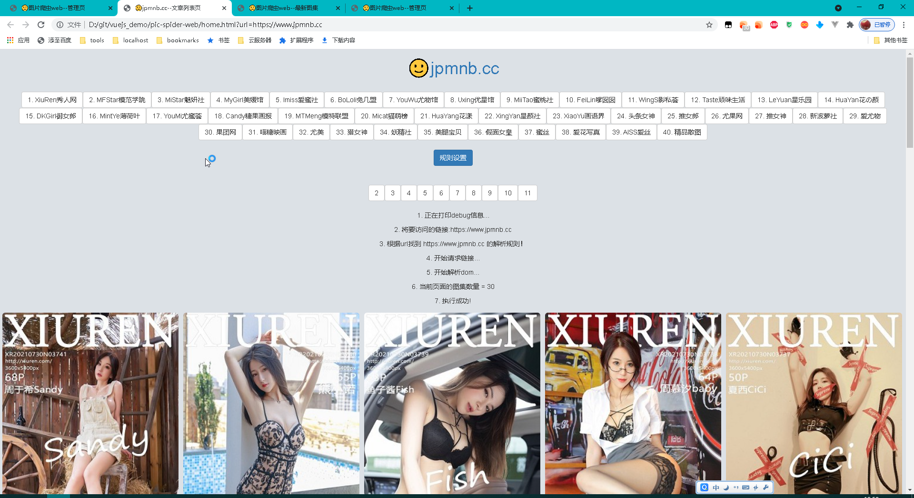
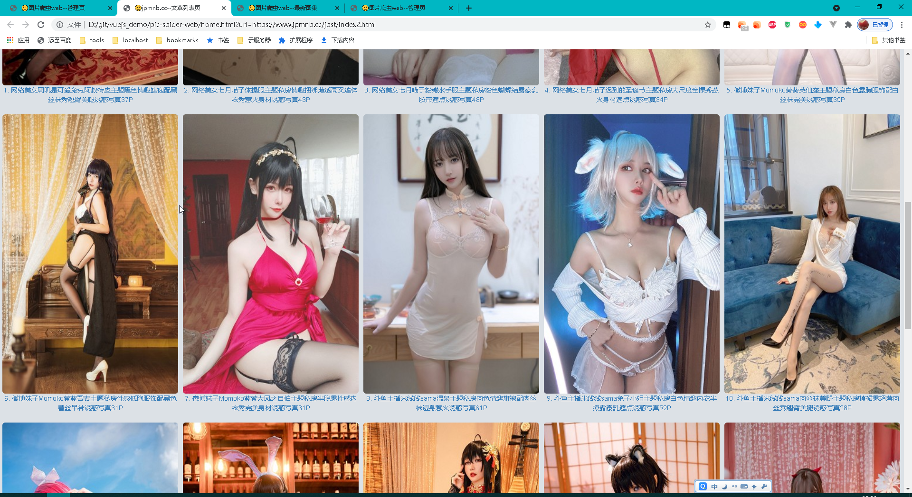
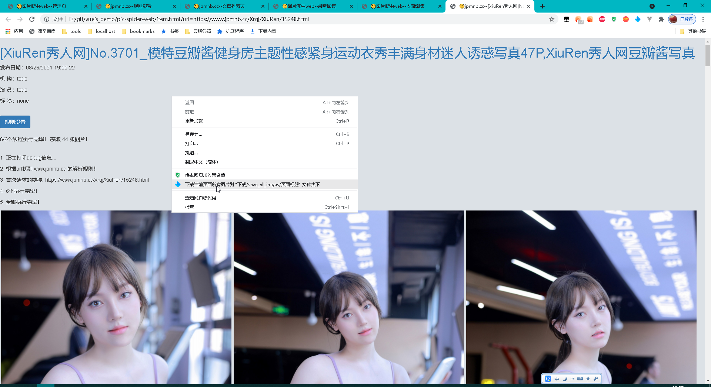
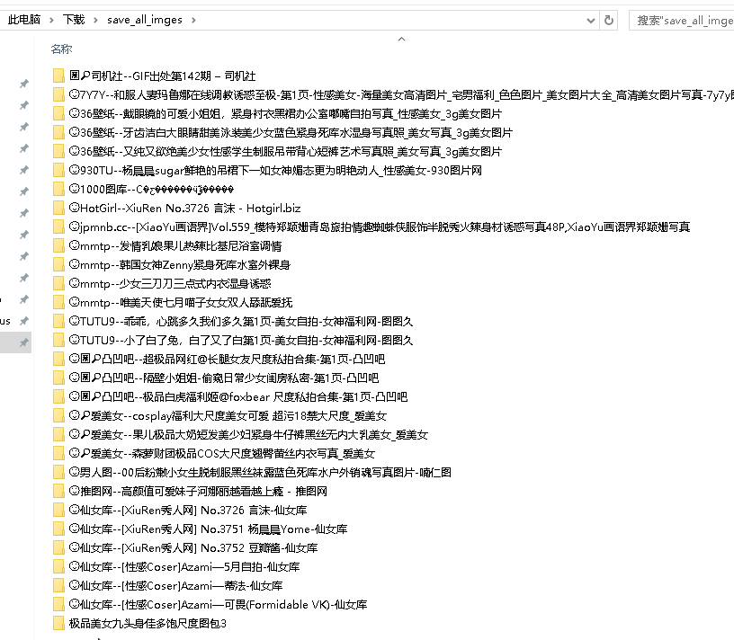
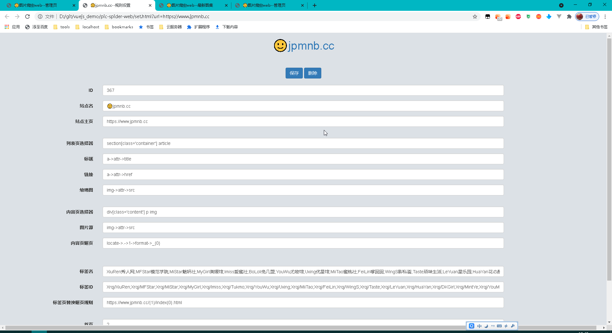
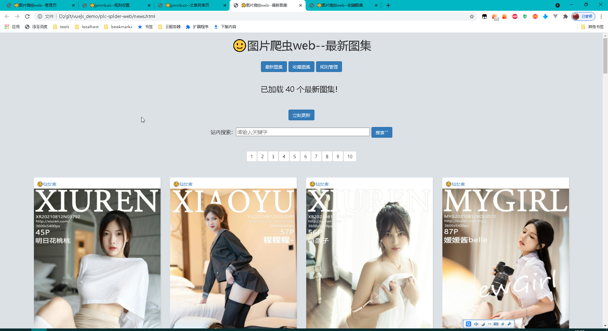
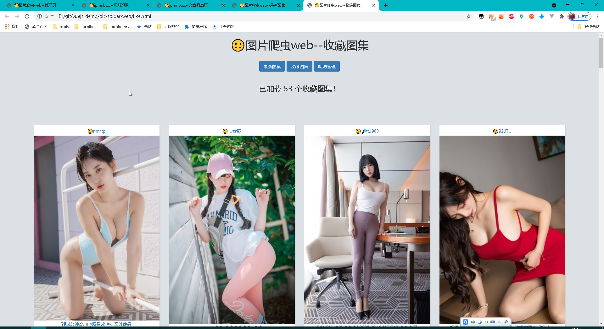

# pic-spider-web

🙂图片爬虫web版

## 关于 pic-spider-web

pic-spider-web 是个人最近学习 vue.js 而开发的一个练手项目，没有任何包装，仅供学习参考，请勿商用。

## 食用方法

1.下载后直接点击“index.html”在浏览器中打开

2.导入web4.json文件

3.have fun !

4.若要批量保存图片到本地，可以使用[这个浏览器插件](https://github.com/htfei/chrome_exts/tree/master/5.1%20%E4%B8%8B%E8%BD%BD%20save_all_images)，好处是能根据图集标题自动创建文件夹，（而且也是本人开发的，很轻量干净）

注: 若加载不出来，则可能是Chrome等浏览器默认禁止跨域,需要开启,设置见[这里](https://www.cnblogs.com/shihaiming/p/10984394.html)
或者使用Chrome插件 谷歌跨域插件：Allow CORS: Access-Control-Allow-Origin （自行百度吧）

## 部分截图

### 1.管理页

```c
导入导出json文件，查看所有的网站;
```


### 2.某个网站的首页

```c
默认打开首页，支持查看分类，翻页，点击图片进入图集详情页
```




### 3.图集详情页


点击标题可以访问图集的原始链接；
若要批量保存图片到本地，可以使用[这个浏览器插件](https://github.com/htfei/chrome_exts/tree/master/5.1%20%E4%B8%8B%E8%BD%BD%20save_all_images)，好处是能根据图集标题自动创建文件夹.





### 4.规则修改页

```c
在管理页点击某个网站后面的修改删除按钮，可进入该页，可编辑该网站的解析规则
```



### 5.最新页（高级）

```c
    1.打开该页面时后台会自动每60分钟请求所有的网站首页，并将图集保存到websql中;
    2.该页面采用瀑布流展示，默认加载最新的40条图集,每次下滑到底部自动加载后续40个图集，直到加载完毕；你也可以点击翻页加载历史图集；
    3.你可以点击图集进入详情页；
    4.你可以点击图集右下角的☆进行收藏，点击上方的【收藏图集】查看收藏；
    5.你可以对websql中已经缓存好的历史图集进行搜索；
```




### 6.收藏页（高级）

```c
    该页面展示你所有的收藏图集，点击图片可查看图集详情；
```

